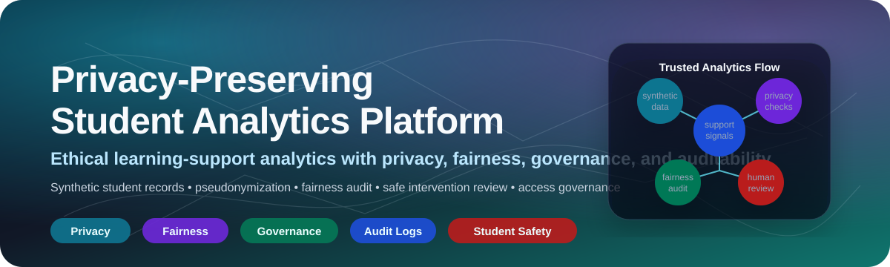
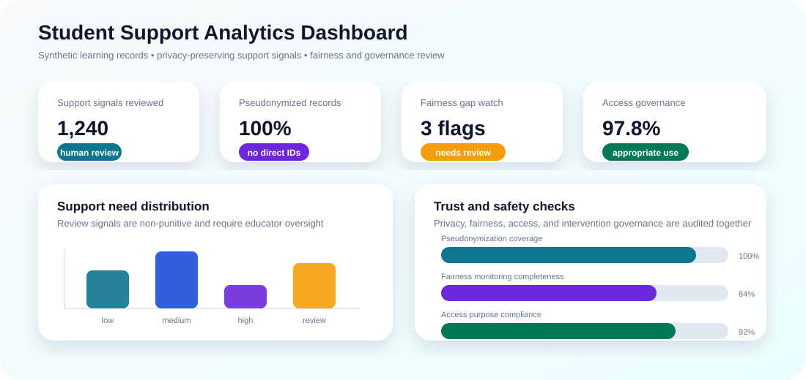
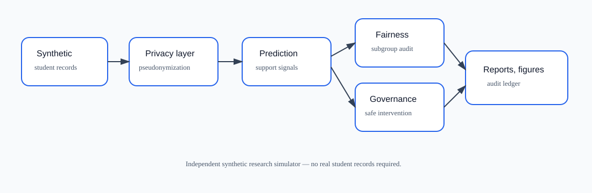
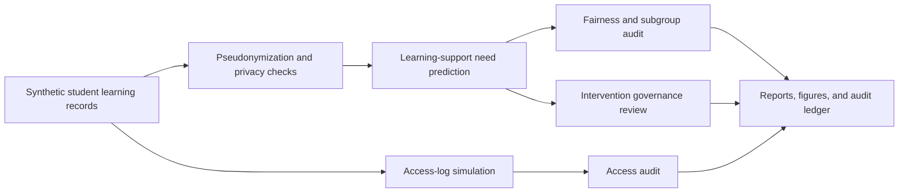
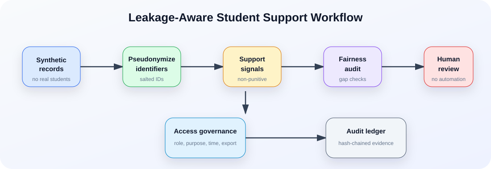

<p align="center">
  
</p>

<h1 align="center">Privacy-Preserving Student Analytics Platform</h1>

<p align="center">
  <b>A research-grade student-support analytics platform for predicting learning-support needs while protecting identity, auditing fairness, governing access, and preventing harmful automated intervention.</b>
</p>

<p align="center">
  <a href="../../actions/workflows/python-checks.yml"></a>
  
  
  
  
  
</p>

---

## Overview

**Privacy-Preserving Student Analytics Platform** is an independent academic research prototype for studying how learning-support analytics can be designed responsibly. It uses fictional synthetic student records, learning activity, access logs, and support-review events to evaluate a pipeline that produces **student-support signals** while preserving privacy, checking fairness, auditing access, and requiring human review.

The project is built around one key idea: **student analytics should support students, not label, punish, rank, or surveil them**.

It is especially useful for research in:

- Privacy-preserving education analytics.
- Responsible AI in learning environments.
- Student-support decision workflows.
- Fairness auditing and subgroup gap analysis.
- Access governance and auditability.
- Synthetic data generation for sensitive domains.

> **Student-support boundary:** This repository uses fictional synthetic students, learning records, access logs, and support-review events by default. It is not a student surveillance system, grading tool, disciplinary system, admissions tool, legal compliance certification, or automatic intervention engine.

<p align="center">
  
</p>

---

## Research objective

Can a privacy-preserving student analytics platform identify learning-support needs while protecting student identity, auditing fairness, and preventing unfair or harmful intervention?

| Research question | Evidence generated locally |
|---|---|
| Which learning records suggest support may be useful? | Support-need prediction table with confidence flags |
| How is student identity protected? | Pseudonymized records and quasi-identifier privacy audit |
| Are support flags distributed fairly across subgroups? | Fairness audit by access, commute, and first-generation proxy groups |
| Are interventions safe and non-punitive? | Intervention governance review and approved wording |
| Are access events appropriate? | Access audit table and suspicious-access flags |
| Can review decisions remain reproducible? | Hash-chained audit ledger |

---

## Architecture

<p align="center">
  
</p>



<p align="center">
  
</p>

---

## Core capabilities

| Capability | What it does | Why it matters |
|---|---|---|
| Synthetic education data | Generates fictional students, learning records, weekly activity, and support events | Enables safe experimentation without real student records |
| Pseudonymization | Replaces direct identifiers with stable salted IDs | Reduces identity exposure in outputs |
| Privacy-risk audit | Checks small quasi-identifier groups | Highlights re-identification risk patterns |
| Support-need scoring | Produces transparent support signals | Helps study early support workflows without black-box claims |
| Fairness audit | Compares support rates and score gaps across groups | Detects possible over-support or under-support risk |
| Intervention governance | Reviews whether wording is safe and non-punitive | Prevents harmful automatic action framing |
| Access-log audit | Flags unusual roles, purposes, after-hours access, and bulk export | Makes privacy governance inspectable |
| Audit ledger | Records reproducible run metadata in a hash-chained log | Supports traceability and research accountability |

---

## Run today — no real student data needed

```bash
python scripts/run_synthetic_student_lab.py
```

Windows quick start:

```bat
cd %USERPROFILE%\privacy-preserving-student-analytics-platform
git pull

py -m venv .venv
.venv\Scripts\activate

python -m pip install --upgrade pip
python -m pip install -r requirements.txt
python scripts/run_synthetic_student_lab.py
```

Optional controls:

```bash
python scripts/run_synthetic_student_lab.py --students 120 --weeks 10 --seed 42
```

Run tests:

```bash
python -m pytest
```

---

## Generated local outputs

```text
outputs/results/synthetic_students.csv
outputs/results/synthetic_learning_records.csv
outputs/results/pseudonymized_students.csv
outputs/results/pseudonymized_learning_records.csv
outputs/results/synthetic_support_need_predictions.csv
outputs/results/synthetic_fairness_audit.csv
outputs/results/synthetic_privacy_risk_audit.csv
outputs/results/synthetic_intervention_governance_review.csv
outputs/results/synthetic_access_log.csv
outputs/results/synthetic_access_audit.csv
outputs/results/synthetic_student_analytics_summary.json
outputs/reports/synthetic_student_analytics_report.md
outputs/audit/student_analytics_audit_log.jsonl

outputs/figures/synthetic_support_need_distribution.png
outputs/figures/synthetic_fairness_gaps.png
outputs/figures/synthetic_privacy_risk.png
outputs/figures/synthetic_access_audit.png
outputs/figures/synthetic_intervention_governance.png
```

---

## Privacy-preserving design

| Area | Design choice |
|---|---|
| Synthetic data only | No real students, names, grades, attendance records, or identities are included |
| Pseudonymization | Stable salted pseudonymous IDs are used for student and access-log records |
| Data minimization | Support scoring uses aggregate learning signals rather than direct identifiers |
| Quasi-identifier audit | Small group sizes are flagged as privacy-risk signals |
| Access governance | Role, purpose, after-hours, sensitivity, and bulk access are reviewed |
| Human review | Support signals are not treated as automatic decisions |
| Auditability | Hash-chained logs preserve traceable experiment evidence |

---

## Fairness and student-safety checks

| Audit area | Example questions |
|---|---|
| Support-rate gap | Are some groups flagged much more often than others? |
| Under-support risk | Are vulnerable or low-access groups less likely to receive support signals? |
| Over-intervention risk | Are any groups exposed to excessive review burden? |
| Score gap | Do average support scores differ sharply across proxy groups? |
| Intervention language | Is the suggested action supportive, non-punitive, and human-reviewed? |
| Appeal boundary | Could a real student contest or correct the interpretation? |

---

## Access governance model

The access-audit layer treats student analytics as sensitive infrastructure. It checks:

- whether the role is appropriate;
- whether the declared purpose is valid;
- whether access occurs after hours;
- whether the event involves sensitive records;
- whether bulk export needs special review;
- whether audit evidence can be reproduced later.

This is a governance simulation, not a production identity-access-management system.

---

## Repository map

```text
src/studentsupport/
  synthetic.py       # fictional students, learning records, and access logs
  privacy.py         # pseudonymization and quasi-identifier audit
  prediction.py      # support-need scoring and uncertainty flags
  fairness.py        # subgroup fairness and over/under-support checks
  intervention.py    # non-punitive intervention governance review
  access.py          # access-log audit
  audit.py           # hash-chained audit ledger
  visualization.py   # local figures
  reporting.py       # Markdown student-support report
scripts/
  run_synthetic_student_lab.py
docs/
  methodology.md
  student_support_boundary.md
  synthetic_lab.md
  report_template.md
  governance-and-ethics.md
  reproducibility-playbook.md
  publication-readiness-plan.md
tests/
  test_synthetic.py
  test_privacy_prediction.py
  test_pipeline.py
  test_audit.py
```

---

## Documentation

- [`docs/methodology.md`](docs/methodology.md): scoring, pseudonymization, privacy, fairness, access audit, and limitations.
- [`docs/student_support_boundary.md`](docs/student_support_boundary.md): safe student-support use boundary.
- [`docs/synthetic_lab.md`](docs/synthetic_lab.md): commands and synthetic output interpretation.
- [`docs/report_template.md`](docs/report_template.md): report structure for experiment outputs.
- [`docs/governance-and-ethics.md`](docs/governance-and-ethics.md): responsible-use, privacy, and fairness principles.
- [`docs/reproducibility-playbook.md`](docs/reproducibility-playbook.md): experiment records, outputs, and sharing checklist.
- [`docs/publication-readiness-plan.md`](docs/publication-readiness-plan.md): research questions and academic extension plan.

---

## Research safeguards

1. Use synthetic records for default experiments.
2. Never treat support scores as labels about a student.
3. Review privacy-risk flags before interpreting results.
4. Report fairness metrics by subgroup.
5. Require human review for every intervention suggestion.
6. Avoid punitive or deficit-based wording.
7. Preserve audit logs with run outputs.
8. State clearly that this is not a deployment-ready education system.

---

## Future extensions

| Extension | Requirement before claiming results |
|---|---|
| Differential privacy accountant | Formal mechanism, privacy budget reporting, and utility trade-off analysis |
| Federated student analytics | Site-level simulation, secure aggregation boundary, and leakage review |
| Real learning-management-system data | Institutional authorization, consent/notice, privacy review, and governance approval |
| Explainable support signals | Human-interpretable feature contribution reports |
| Educator dashboard | Role-based access, audit trails, and accessibility review |
| Student-facing transparency | Explanation, correction, and appeal workflows |

---

## Limitations

- Synthetic data validates the pipeline but does not prove real-world educational impact.
- Support-need scores are review signals, not diagnoses, grades, or student labels.
- Fairness metrics are descriptive and must be interpreted with education experts.
- Pseudonymization does not make real sensitive data automatically safe.
- Real deployments require privacy, legal, accessibility, educator, student, guardian, and institutional governance.

## License

Released under the [MIT License](LICENSE). Real student records are not included.
