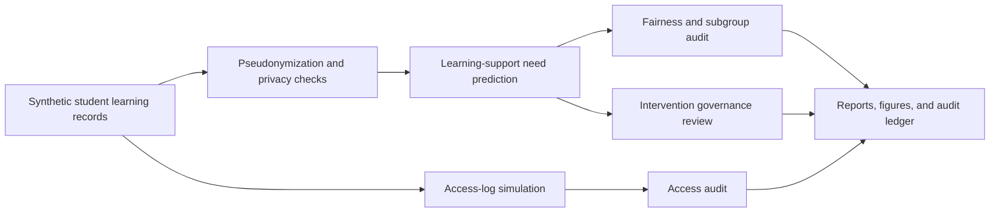

# Privacy-Preserving Student Analytics Platform

<p align="center"><strong>Independent research-grade student-support analytics platform for predicting learning support needs while protecting student identity, auditing fairness, and preventing unfair or harmful intervention using synthetic education data.</strong></p>

<p align="center">
  <a href="../../actions/workflows/python-checks.yml"></a>
  <a href="LICENSE"></a>
  
  
</p>

> **Student-support boundary:** this repository uses fictional synthetic students, learning records, access logs, and support-review events by default. It is independent research and student-support review infrastructure only. It is not a student surveillance system, grading tool, disciplinary system, admissions tool, legal compliance certification, or automatic intervention engine.

---

## Research objective

Can a privacy-preserving student analytics platform identify learning-support needs while protecting student identity, auditing fairness, and preventing unfair or harmful intervention?

| Research question | Evidence generated locally |
| --- | --- |
| Which learning records suggest support may be useful? | Support-need prediction table with confidence flags |
| How is student identity protected? | Pseudonymized records and quasi-identifier privacy audit |
| Are support flags distributed fairly across subgroups? | Fairness audit by access, commute, and first-generation proxy groups |
| Are interventions safe and non-punitive? | Intervention governance review and approved wording |
| Are access events appropriate? | Access audit table and suspicious-access flags |
| Can review decisions remain reproducible? | Hash-chained audit ledger |

---

## Architecture

<p align="center"></p>



---

## Run today — no real student data needed

```bash
python scripts/run_synthetic_student_lab.py
```

Windows quick start:

```bat
cd %USERPROFILE%\privacy-preserving-student-analytics-platform
git pull

py -m venv .venv
.venv\Scripts\activate

python -m pip install --upgrade pip
python -m pip install -r requirements.txt
python scripts/run_synthetic_student_lab.py
```

Optional controls:

```bash
python scripts/run_synthetic_student_lab.py --students 120 --weeks 10 --seed 42
```

---

## Generated local outputs

```text
outputs/results/synthetic_students.csv
outputs/results/synthetic_learning_records.csv
outputs/results/pseudonymized_students.csv
outputs/results/pseudonymized_learning_records.csv
outputs/results/synthetic_support_need_predictions.csv
outputs/results/synthetic_fairness_audit.csv
outputs/results/synthetic_privacy_risk_audit.csv
outputs/results/synthetic_intervention_governance_review.csv
outputs/results/synthetic_access_log.csv
outputs/results/synthetic_access_audit.csv
outputs/results/synthetic_student_analytics_summary.json
outputs/reports/synthetic_student_analytics_report.md
outputs/audit/student_analytics_audit_log.jsonl

outputs/figures/synthetic_support_need_distribution.png
outputs/figures/synthetic_fairness_gaps.png
outputs/figures/synthetic_privacy_risk.png
outputs/figures/synthetic_access_audit.png
outputs/figures/synthetic_intervention_governance.png
```

---

## Privacy-preserving design

| Area | What is included |
| --- | --- |
| Synthetic data | No real student records, names, grades, or identities |
| Pseudonymization | Stable salted pseudonymous IDs for students and access logs |
| Privacy risk audit | k-anonymity-style group-size checks for quasi-identifiers |
| Data minimization | Prediction uses aggregate learning signals, not names or direct identifiers |
| Access governance | Role, purpose, after-hours, and high-sensitivity access checks |
| Auditability | Hash-chained audit records for reproducible review |

---

## What the system audits

| Audit area | Examples |
| --- | --- |
| Learning support | Engagement trend, attendance trend, completion pattern, help-seeking signal |
| Fairness | Support-rate gap, mean-score gap, over-intervention risk, under-support risk |
| Privacy | Small-group risk, quasi-identifier grouping, pseudonymized outputs |
| Intervention governance | Human review, safe language, no automatic discipline, no automatic grade action |
| Access | Unusual role access, after-hours access, unsupported purpose, bulk export review |

---

## Independent student-support boundary

This project is an independent synthetic research simulator. Real-world use would require student consent and notice, data-protection review, educator oversight, fairness validation, appeal pathways, retention controls, accessibility review, and local policy governance.

The system should never be used as the sole basis for grading, discipline, admissions, immigration decisions, scholarship decisions, surveillance, automated interventions, or high-stakes educational decisions.

---

## Repository map

```text
src/studentsupport/
  synthetic.py       # fictional students, learning records, and access logs
  privacy.py         # pseudonymization and quasi-identifier audit
  prediction.py      # support-need scoring and uncertainty flags
  fairness.py        # subgroup fairness and over/under-support checks
  intervention.py    # non-punitive intervention governance review
  access.py          # access-log audit
  audit.py           # hash-chained audit ledger
  visualization.py   # local figures
  reporting.py       # Markdown student-support report
scripts/
  run_synthetic_student_lab.py
docs/
  methodology.md
  student_support_boundary.md
  synthetic_lab.md
  report_template.md
tests/
  test_synthetic.py
  test_privacy_prediction.py
  test_pipeline.py
  test_audit.py
```

---

## Limitations

- Synthetic data validates the pipeline but does not prove real-world educational impact.
- Support-need scores are review signals, not diagnoses or labels.
- Fairness metrics are descriptive and must be interpreted with education experts.
- Real deployments require privacy, legal, accessibility, educator, student, and guardian governance.
